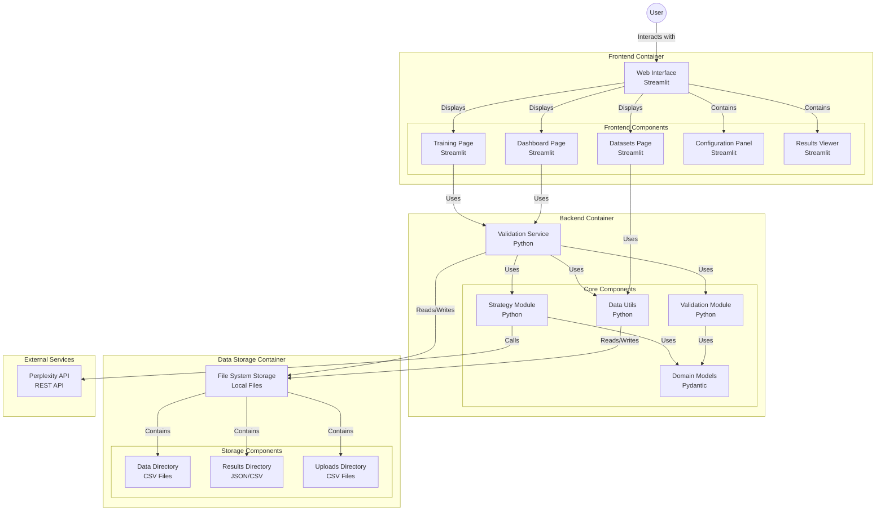

# Seagent Healthcare Provider Validation Dashboard

## 1. User Setup and Running the Application

### Requirements
- **Python 3.x**
- **Streamlit**
- **Conda** (optional, for environment management)
- Other dependencies listed in `requirements.txt`

### Setup Steps

1. **Clone the Repository:**
   ```bash
   git clone <your-repo-url>
   cd <your-repo-directory>
   ```

2. **Create and Activate a Virtual Environment (Optional) Conda:**
   ```bash
   conda env create -n seagent -f environment.yml   
   ```
  
3. **Set Up Environment Variables:**
   Create a `.env` file in the project root with the following content:
   ```dotenv
   PERPLEXITY_API_KEY=[INSERT_CODE_HERE -- yes, I deleted the API key, so don't go back into the commits]
   PERPLEXITY_API_URL=https://api.perplexity.ai/chat/completions
   PERPLEXITY_MODEL=sonar-pro
   ```

4. **Run the Dashboard:**
   ```bash
   streamlit run app.py
   ```
---

## 2. Technical Architecture and Diagram

The dashboard is built using **Streamlit** and is organized into modular components. Its key components are:

- **UI (Streamlit App):**
  - Displays global statistics, data tables, provider summaries, and detailed per-firm reports.
  - Allows CSV input (preloaded or uploaded) and outputs validation results in real time.

- **Modules:**
  - **data_utils:** Manages file operations (saving uploads, listing datasets).
  - **validation:** Handles CSV processing and integrates with the Perplexity API to validate data.
  - **strategies:** Implements two validation strategies: batch and threaded.
  - **models:** Defines Pydantic models for structured API responses.

- **Utilities:**
  - **perplexity_client:** Manages communication with the Perplexity API (rate limiting, payload formatting).

- **Configuration:**
  - Environment variables (from `.env`) provide API credentials and endpoints.

Below is a Mermaid diagram illustrating the workflow:



---

## 3. What It Is and Why It's Used

**What It Is:**  
The Seagent Healthcare Provider Validation Dashboard is an enterprise-style application that validates healthcare provider data. It integrates with the Perplexity API to check CSV records using two strategies (batch and threaded) and displays the results in a sleek, user-friendly interface. The dashboard presents global statistics, detailed validation tables, provider summaries, and individual firm reports—all of which can be downloaded for further analysis.

**Why It's Used:**  
- **Data Quality Assurance:** Healthcare provider records often contain outdated or incorrect data. This dashboard helps quickly identify which records are valid, which need review, and which are incorrect.
- **Efficiency:** Automates the process of validating large datasets, reducing manual review time and increasing the accuracy of provider information.
- **Decision Support:** By presenting data visually (with color-coded tables and statistics), stakeholders can easily understand the overall data quality and make informed decisions.
- **Modular and Scalable:** The system is designed with modular components, making it easy to extend, customize, and integrate into larger enterprise systems.
- **User-Friendly:** The dashboard’s intuitive UI ensures that users can quickly upload data, review validation results, and download detailed reports without needing deep technical knowledge.

---

Enjoy using the Seagent Healthcare Provider Validation Dashboard to streamline and improve the accuracy of healthcare provider data!
